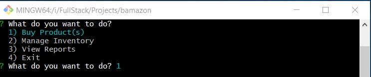
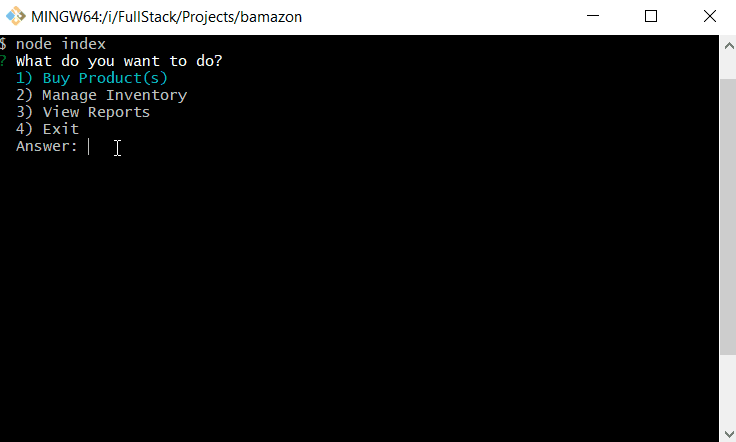
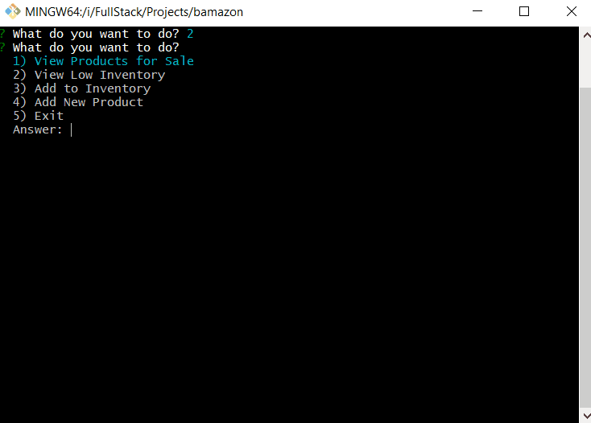
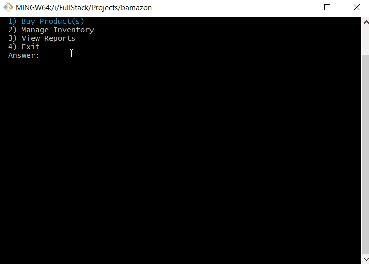

# Bamazon

## Overview

Bamazon is a Node CLI application which uses a MySQL database to store product and department data. In the main menu, there are three options.



## Buy Products

Customers can choose this menu to place an purchase order. It will first display all of the items available for sale.

The customer is then prompted for the product ID and quantity he or she would like to buy.

After the cusomter has placed the order, the application will check if there's enough stock to meet the customer's request and updates the stock quantity in the database. The total purchase purchase price is calculated and also tracked in the database for each product.

If there's not enough stock, the application displays a message `Insufficient quantity!` and then prevents the order from going through.



## Manage Inventory

Managers can choose this menu to manage products in the store. It will first display the menu options below:

    * View Products for Sale

    * View Low Inventory

    * Add to Inventory

    * Add New Product

If a manager selects `View Products for Sale`, all products in the database will be displayed with their IDs, names, prices, and quantities.

If a manager selects `View Low Inventory`, the application will display all products with an inventory count lower than five.

If a manager selects `Add to Inventory`, the application allows the manager to add more quantity of any product in the store.

If a manager selects `Add New Product`, the application allows the manager to add a completely new product to the store.



## View Reports

This application is for supervisor to manage departments in the store. It will first display the menu options below:

    * View Product Sales by Department

    * Create New Department

If a supervisor selects `View Product Sales by Department`, the application will display a summarized table of each department's sale.

If a supervisor selects `Create New Department`, the application allows the supervisor to add a completely new department to the store.



## How to Install

To run bamazon, you will first need to clone the repository to your local machine.

    HTTPS:
    ```
    $ git clone https://github.com/jt0398/bamazon.git
    ````
    SSH:
    ````
    $ git clone git@github.com:jt0398/bamazon.git
    ````

You will also need to download [MySQL](https://dev.mysql.com/downloads/mysql/) and [MySQL Workbench](https://dev.mysql.com/downloads/workbench/) and [install/setup](https://dev.mysql.com/doc/workbench/en/wb-installing.html).

Update config.js with your MySQL username and password.

Open up Workbench and [connect](https://dev.mysql.com/doc/workbench/en/wb-getting-started-tutorial-create-connection.html) to your database server.

Open a new [SQL Editor](https://dev.mysql.com/doc/workbench/en/wb-sql-editor.html) and copy the scripts in SchemaSeeds.sql

Open a new terminal and browser to the folder where the project is cloned. Run the command.

    ````
    $ node index.js
    ````
